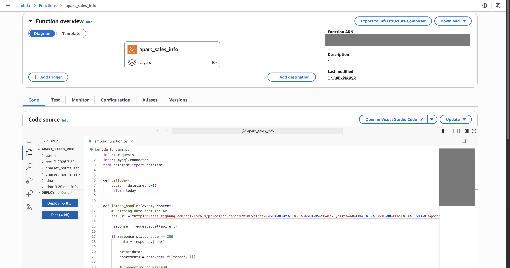
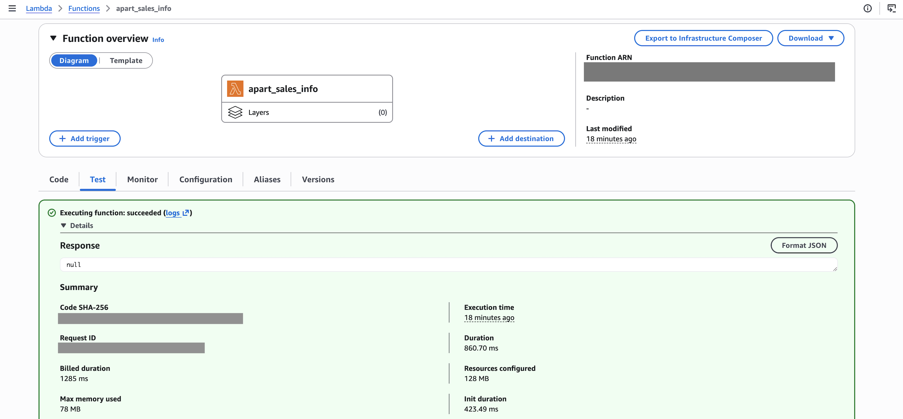
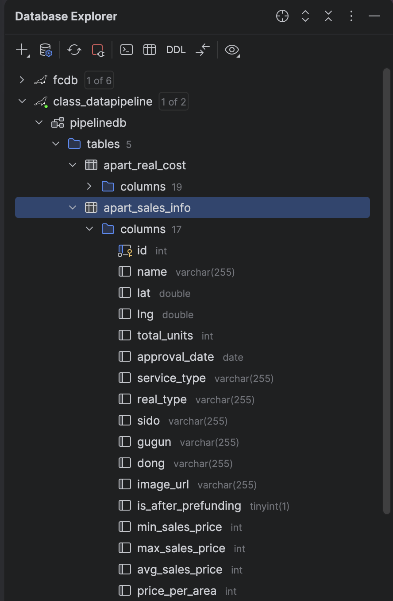
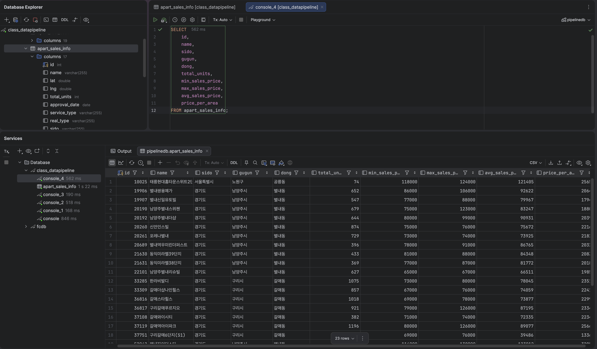
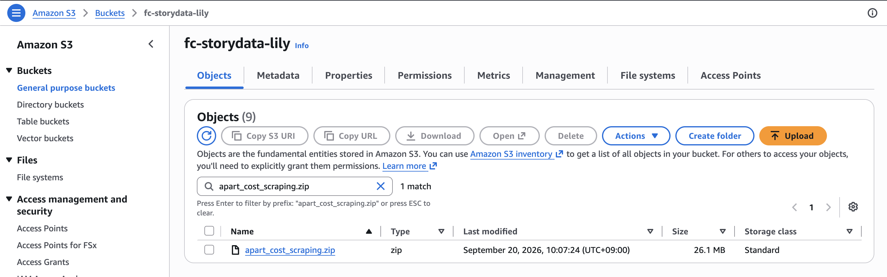

# Serverless Apartment Data Pipeline

A serverless data ingestion pipeline that collects apartment sales information from the Zigbang API, transforms the API response into structured records, and stores the data in MariaDB hosted on Amazon RDS.

This project started as a Python-based apartment data collection script and was later migrated to AWS Lambda to create a lightweight serverless data ingestion workflow.

---

## Project Overview

The goal of this project was to collect apartment sales information from a selected area through the Zigbang API and store the structured data in a relational database.

The project was initially developed as a Python script running on an Amazon EC2 instance. After validating the API response and database insertion process, the script was converted into an AWS Lambda function.

### Data Flow

```text
Zigbang API
     │
     │ HTTPS GET Request
     ▼
Python / AWS Lambda
     │
     │ JSON Parsing & Transformation
     ▼
Amazon RDS
MariaDB
     │
     ▼
apart_sales_info
     │
     ▼
DataGrip
```

---

## Project Objectives

- Collect apartment sales information through a REST API
- Parse and transform JSON API responses
- Store structured data in a relational database
- Build and test the initial pipeline using Python on Amazon EC2
- Migrate the Python script to AWS Lambda
- Package external Python dependencies for Lambda deployment
- Upload the deployment package to Amazon S3
- Validate the final data pipeline using Amazon RDS and DataGrip
- Gain hands-on experience with serverless data ingestion architecture

---

## Architecture

```text
                    ┌─────────────────────┐
                    │     Zigbang API     │
                    │     REST API         │
                    └──────────┬──────────┘
                               │
                               │ HTTPS GET
                               ▼
                    ┌─────────────────────┐
                    │    AWS Lambda       │
                    │                     │
                    │ Python 3.13         │
                    │ JSON Parsing        │
                    │ Data Transformation│
                    └──────────┬──────────┘
                               │
                               │ SQL INSERT
                               ▼
                    ┌─────────────────────┐
                    │     Amazon RDS      │
                    │      MariaDB        │
                    │                     │
                    │   pipelinedb        │
                    │ apart_sales_info    │
                    └──────────┬──────────┘
                               │
                               ▼
                    ┌─────────────────────┐
                    │      DataGrip       │
                    │ Data Validation     │
                    └─────────────────────┘

Deployment:
Python Dependencies
        │
        ▼
   ZIP Package
        │
        ▼
    Amazon S3
        │
        ▼
   AWS Lambda
```

---

## Technology Stack

| Category | Technology |
|---|---|
| Programming Language | Python 3.13 |
| API | Zigbang REST API |
| Cloud | AWS |
| Compute | AWS Lambda |
| Storage | Amazon S3 |
| Database | Amazon RDS |
| Database Engine | MariaDB |
| Database Client | DataGrip |
| Operating System | Amazon Linux 2023 |
| Python Libraries | requests, mysql-connector-python |
| SQL | MariaDB SQL |
| Development Environment | Amazon EC2 |
| Version Control | Git / GitHub |

---

# 1. Database Setup

The first step was to create a table in the MariaDB database hosted on Amazon RDS.

Database:

```text
pipelinedb
```

Table:

```text
apart_sales_info
```

### Table Schema

```sql
CREATE TABLE apart_sales_info (
    id INT PRIMARY KEY,
    name VARCHAR(255),
    lat DOUBLE,
    lng DOUBLE,
    total_units INT,
    approval_date DATE,
    service_type VARCHAR(255),
    real_type VARCHAR(255),
    sido VARCHAR(255),
    gugun VARCHAR(255),
    dong VARCHAR(255),
    image_url VARCHAR(255),
    is_after_prefunding BOOLEAN,
    min_sales_price INT,
    max_sales_price INT,
    avg_sales_price INT,
    price_per_area INT
);
```

The table was designed to store apartment identification, location, building information, and sales price information returned by the API.

---

# 2. Initial Python Environment on EC2

The initial version of the pipeline was developed on an Amazon EC2 instance running Amazon Linux 2023.

A Python virtual environment was created to isolate the project dependencies.

```bash
mkdir scraping
cd scraping

python3 -m venv scr_env
source ./scr_env/bin/activate
```

The virtual environment was later recreated using Python 3.13 for Lambda compatibility.

### Python Version

```bash
python --version
```

Result:

```text
Python 3.13.14
```

The Python executable was confirmed to be inside the virtual environment:

```bash
which python
```

Example:

```text
/home/ec2-user/scraping/scr_env/bin/python
```

---

# 3. Installing Python Dependencies

The initial course workflow included the following packages:

```bash
pip install requests
pip install bs4
pip install mysql-connector-python
```

However, after reviewing the final implementation, BeautifulSoup (`bs4`) was not required because the Zigbang endpoint returned JSON data directly.

The final implementation therefore relied mainly on:

```text
requests
mysql-connector-python
```

`datetime` was also used, but it is part of Python's standard library and does not need to be installed separately.

---

# 4. Collecting Data from the Zigbang API

The pipeline retrieves apartment information through a Zigbang REST API endpoint.

The API request is made using Python's `requests` library.

```python
import requests

response = requests.get(api_url)

if response.status_code == 200:
    data = response.json()
```

The API response is JSON, and the apartment records are retrieved from the `filtered` field.

```python
apartments = data.get('filtered', [])
```

This produces a collection of apartment records that can then be transformed before being inserted into the database.

---

# 5. JSON Data Transformation

The API response contains multiple fields describing each apartment.

The pipeline extracts the required fields and creates a structured dictionary for database insertion.

```python
sales_data = json_data.get('price', {}).get('sales', {})

insert_data = {
    'id': json_data['id'],
    'name': json_data['name'],
    'lat': json_data['lat'],
    'lng': json_data['lng'],
    'total_units': json_data.get('총세대수'),
    'approval_date': json_data.get('사용승인일'),
    'service_type': json_data.get('서비스구분'),
    'real_type': json_data.get('real_type'),
    'sido': json_data.get('sido'),
    'gugun': json_data.get('gugun'),
    'dong': json_data.get('dong'),
    'image_url': json_data.get('image'),
    'is_after_prefunding': json_data.get('is후분양'),
    'min_sales_price': sales_data.get('min'),
    'max_sales_price': sales_data.get('max'),
    'avg_sales_price': sales_data.get('avg'),
    'price_per_area': sales_data.get('perArea')
}
```

This transformation converts the nested JSON response into a structure that matches the relational database schema.

---

# 6. Connecting to Amazon RDS

The Python script connects to the MariaDB database hosted on Amazon RDS using `mysql-connector-python`.

```python
conn = mysql.connector.connect(
    host="YOUR_RDS_ENDPOINT",
    user="YOUR_RDS_USERNAME",
    port="3306",
    password="YOUR_RDS_PASSWORD",
    database="pipelinedb"
)
```

Credentials are intentionally represented as placeholders in this repository to avoid exposing sensitive information.

---

# 7. Inserting Data into MariaDB

The transformed records are inserted into the `apart_sales_info` table using a parameterized SQL statement.

```python
sql = """
    INSERT INTO apart_sales_info (
        id, name, lat, lng, total_units, approval_date, service_type,
        real_type, sido, gugun, dong, image_url, is_after_prefunding,
        min_sales_price, max_sales_price, avg_sales_price, price_per_area
    ) VALUES (
        %(id)s, %(name)s, %(lat)s, %(lng)s, %(total_units)s, %(approval_date)s,
        %(service_type)s, %(real_type)s, %(sido)s, %(gugun)s, %(dong)s,
        %(image_url)s, %(is_after_prefunding)s, %(min_sales_price)s,
        %(max_sales_price)s, %(avg_sales_price)s, %(price_per_area)s
    )
"""

cursor.execute(sql, insert_data)
conn.commit()
```

Using parameterized SQL helps separate SQL syntax from the actual data values being inserted.

---

# 8. Error Handling

Each apartment record is processed inside a `try-except` block.

```python
try:
    # Transform API data
    # Insert data into MariaDB
    cursor.execute(sql, insert_data)
    conn.commit()

except Exception as e:
    print(f"Error processing data: {e}")
    continue
```

This allows the pipeline to continue processing subsequent records if an individual record causes an exception.

---

# 9. Migrating the Python Script to AWS Lambda

After validating the Python-based data collection and database insertion process on EC2, the script was migrated to AWS Lambda.

The Lambda function follows the same basic workflow:

```text
API Request
     ↓
JSON Response
     ↓
Data Extraction
     ↓
Data Transformation
     ↓
MariaDB Connection
     ↓
SQL INSERT
     ↓
Database
```

The main difference is that the application logic is now executed as a serverless Lambda function instead of a continuously running EC2-based Python script.

---

# 10. Python Runtime Migration: 3.9 → 3.13

The original course environment used Python 3.9.

During implementation, I migrated the project to Python 3.13 because Python 3.9 was no longer appropriate for the Lambda runtime used for the final deployment.

The Python environment was recreated using:

```bash
python3.13 -m venv scr_env
source ./scr_env/bin/activate
```

The Python version was verified with:

```bash
python --version
```

Result:

```text
Python 3.13.14
```

The dependency packages were then installed into the Python 3.13 virtual environment.

This required rebuilding the Lambda deployment package so that compiled dependencies matched the Python 3.13 runtime.

---

# 11. Lambda Function

The final Lambda function was implemented in:

```text
lambda_function.py
```

The function entry point is:

```python
def lambda_handler(event, context):
```

The overall Lambda logic is:

```python
def lambda_handler(event, context):

    # 1. Request data from Zigbang API
    response = requests.get(api_url)

    # 2. Check API response
    if response.status_code == 200:

        # 3. Parse JSON
        data = response.json()

        # 4. Extract apartment records
        apartments = data.get('filtered', [])

        # 5. Connect to MariaDB
        conn = mysql.connector.connect(...)

        # 6. Insert transformed records
        for json_data in apartments:
            ...

        # 7. Close database connection
        cursor.close()
        conn.close()
```

---

# 12. Packaging Lambda Dependencies

AWS Lambda does not automatically include third-party libraries such as:

```text
requests
mysql-connector-python
```

Therefore, the dependencies were packaged together with the Lambda function.

The relevant Python 3.13 site-packages directory was used:

```text
scr_env/lib/python3.13/site-packages/
```

The deployment package included:

```text
lambda_function.py
requests/
mysql/
urllib3/
certifi/
charset_normalizer/
idna/
...
```

The package also contained the compiled MySQL Connector module compatible with Python 3.13.

For example:

```text
_mysql_connector.cpython-313-x86_64-linux-gnu.so
```

This was important because the Lambda runtime needed Python 3.13-compatible dependencies.

---

# 13. Creating the Lambda ZIP Package

The Python dependencies and Lambda function were compressed into a ZIP deployment package.

Example:

```bash
cd scr_env/lib/python3.13/site-packages

zip -r ~/apart_cost_scraping.zip .

cd ~
zip -g apart_cost_scraping.zip lambda_function.py
```

The resulting deployment package was:

```text
apart_cost_scraping.zip
```

---

# 14. Uploading the Deployment Package to Amazon S3

The Lambda deployment package was uploaded to Amazon S3.

```bash
aws s3 cp apart_cost_scraping.zip s3://fc-storydata/
```

The S3 bucket used for the deployment package was:

```text
fc-storydata
```

The ZIP file was then used as the Lambda deployment source.

---

# 15. AWS Lambda Configuration

The Lambda function was configured to use the Python 3.13 runtime.

Key configuration:

```text
Runtime:
Python 3.13
```

The deployment package was uploaded from Amazon S3.

The Lambda handler was configured as:

```text
lambda_function.lambda_handler
```

---

# 16. Testing and Troubleshooting

During the migration from the Python script to Lambda, several syntax errors occurred while editing the function directly in the Lambda console.

### Issue 1: Unterminated String Literal

An API URL was accidentally split across multiple lines, resulting in an error similar to:

```text
SyntaxError: unterminated string literal
```

The API URL was corrected so that it remained a valid Python string.

---

### Issue 2: Unexpected Indentation

Some lines had inconsistent indentation.

Examples included:

```text
unexpected indent
```

The Lambda function was rewritten using consistent 4-space Python indentation.

After correcting the indentation and string formatting, the Lambda function executed successfully.

---

# 17. Data Validation

After successfully executing the Lambda function, the inserted records were checked in MariaDB using DataGrip.

The validation process confirmed that:

```text
Zigbang API
     ↓
AWS Lambda
     ↓
Amazon RDS / MariaDB
     ↓
apart_sales_info
```

was functioning as expected.

The database table contained the transformed apartment records retrieved from the API.

---

# 18. Key Data Fields

| Field | Description |
|---|---|
| `id` | Apartment identifier |
| `name` | Apartment name |
| `lat` | Latitude |
| `lng` | Longitude |
| `total_units` | Number of households |
| `approval_date` | Building approval date |
| `service_type` | Service classification |
| `real_type` | Real estate type |
| `sido` | Province / metropolitan city |
| `gugun` | District |
| `dong` | Neighborhood |
| `image_url` | Apartment image URL |
| `is_after_prefunding` | Whether it is a post-sale project |
| `min_sales_price` | Minimum sales price |
| `max_sales_price` | Maximum sales price |
| `avg_sales_price` | Average sales price |
| `price_per_area` | Price per area |

---

# 19. Project Structure

The GitHub repository is organized as follows:

```text
serverless-apartment-data-pipeline/
│
├── README.md
│
├── lambda/
│   └── lambda_function.py
│
├── screenshots/
│   ├── 01-lambda-function.png
│   ├── 02-lambda-test-success.png
│   ├── 03-database-schema.png
│   ├── 04-database-result.png
│   └── 05-s3-deployment-package.png
│
└── .gitignore
```

The repository contains the core Lambda source code and selected screenshots demonstrating the deployment and validation process.

---

# 20. GitHub `.gitignore`

Sensitive credentials and local development files should not be committed to GitHub.

Example:

```gitignore
__pycache__/
*.pyc
scr_env/
*.zip
.env
```

Database passwords and other credentials should also be stored outside the source code in a real-world implementation.

---

# 21. Challenges and Solutions

## Challenge 1: Migrating from Python 3.9 to Python 3.13

The original project used Python 3.9, but the final Lambda environment used Python 3.13.

### Solution

A new Python 3.13 virtual environment was created, dependencies were reinstalled, and the Lambda deployment package was rebuilt.

---

## Challenge 2: Lambda Dependency Packaging

Libraries such as `mysql-connector-python` are not included in the default Lambda runtime.

### Solution

The required third-party packages were installed into the Python 3.13 virtual environment and packaged together with the Lambda function.

---

## Challenge 3: Compiled Dependency Compatibility

`mysql-connector-python` contains compiled components.

### Solution

The dependency package was rebuilt inside the Amazon Linux 2023 EC2 environment using Python 3.13, producing a compatible compiled module such as:

```text
_mysql_connector.cpython-313-x86_64-linux-gnu.so
```

---

## Challenge 4: Lambda Console Syntax Errors

Manual editing of the Lambda function caused string and indentation errors.

### Solution

The Lambda function was reformatted using consistent Python indentation and the API URL was corrected to a valid single-line string.

---

## Challenge 5: Database Connectivity

The Lambda function needed to connect to MariaDB hosted on Amazon RDS.

### Solution

The RDS connection configuration was validated and the database insertion process was tested using DataGrip.

---

# 22. What I Learned

Through this project, I gained hands-on experience with:

- REST API data ingestion
- JSON parsing and transformation
- Relational database design
- SQL INSERT operations
- MariaDB
- Amazon RDS
- AWS Lambda
- Amazon S3
- Python virtual environments
- Python dependency management
- Lambda deployment packages
- Python runtime compatibility
- Amazon Linux
- EC2-based development workflows
- Cloud-based data pipeline architecture
- Troubleshooting Lambda deployment and runtime errors
- Validating pipeline results with a database client

---

# 23. Data Engineering Concepts Demonstrated

This project demonstrates several practical data engineering concepts:

### Data Ingestion

Retrieving raw data from an external REST API.

### Data Transformation

Converting nested JSON data into structured records suitable for relational storage.

### Data Storage

Persisting transformed data in a MariaDB relational database hosted on Amazon RDS.

### Serverless Processing

Using AWS Lambda to execute data processing without maintaining a continuously running application server.

### Dependency Management

Packaging external Python libraries and compiled dependencies for a cloud runtime.

### Cloud Deployment

Using Amazon S3 as the deployment package source for AWS Lambda.

### Data Validation

Verifying the final records in MariaDB through DataGrip.

---

# 24. Future Improvements

Potential improvements for a production-oriented version include:

### Scheduled Data Collection

Use Amazon EventBridge to trigger the Lambda function automatically on a schedule.

```text
EventBridge
     ↓
AWS Lambda
     ↓
Zigbang API
     ↓
Amazon RDS
```

### Secure Credential Management

Move database credentials out of the source code and use:

- AWS Secrets Manager
- AWS Systems Manager Parameter Store
- Lambda environment variables

### Duplicate Handling

Implement `UPSERT` or duplicate detection so that repeated executions do not create duplicate records.

### Monitoring

Improve operational monitoring using:

- Amazon CloudWatch Logs
- CloudWatch Metrics
- CloudWatch Alarms

### Data Quality Validation

Add validation rules for:

- Missing apartment IDs
- Invalid coordinates
- Missing prices
- Invalid dates
- Duplicate records

### Analytics Dashboard

Connect the database to Power BI to visualize:

- Apartment price ranges
- Average sales prices
- Price per area
- Geographic distribution
- Apartment size and household counts

---

## Screenshots

### 1. AWS Lambda Function

The Lambda function retrieves apartment data from the Zigbang API, transforms the JSON response, and inserts the data into Amazon RDS.



### 2. Lambda Test Result

The deployed Lambda function was successfully executed and completed the data ingestion process.



### 3. Database Schema

The `apart_sales_info` table in MariaDB contains structured apartment and sales information.



### 4. Database Result

The collected apartment data was successfully stored in Amazon RDS and verified using DataGrip.



### 5. S3 Deployment Package

The Lambda deployment package containing the Python function and required dependencies was uploaded to Amazon S3.



---

# 25. Project Outcome

The final implementation successfully demonstrates an end-to-end serverless data ingestion workflow:

```text
External REST API
       ↓
AWS Lambda
       ↓
JSON Transformation
       ↓
SQL INSERT
       ↓
Amazon RDS / MariaDB
       ↓
Data Validation
```

The project also demonstrates the migration of a traditional Python-based data collection script into a cloud-based serverless architecture.

It provided practical experience in building a complete data ingestion workflow using Python, REST APIs, SQL, AWS Lambda, Amazon RDS, Amazon S3, and Linux-based deployment workflows.
